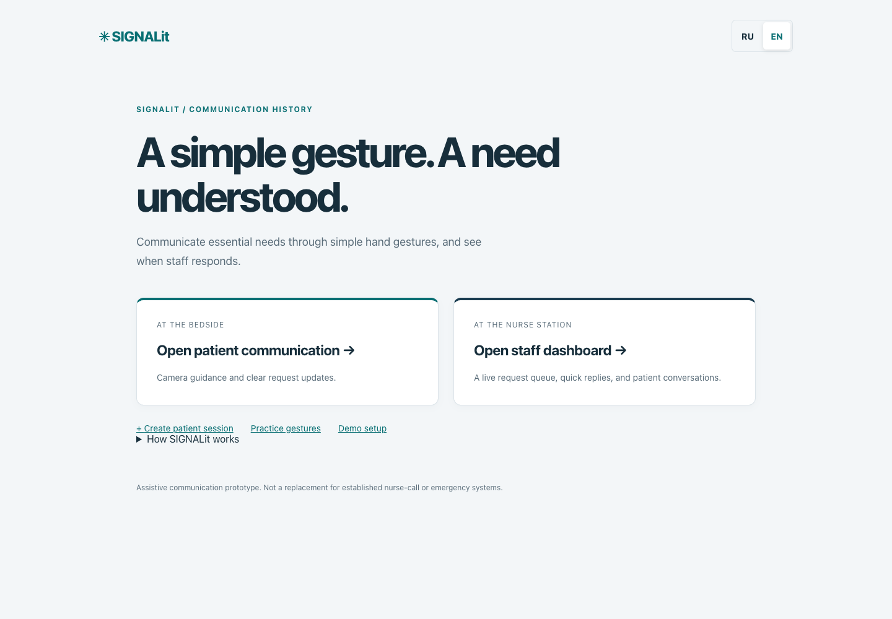
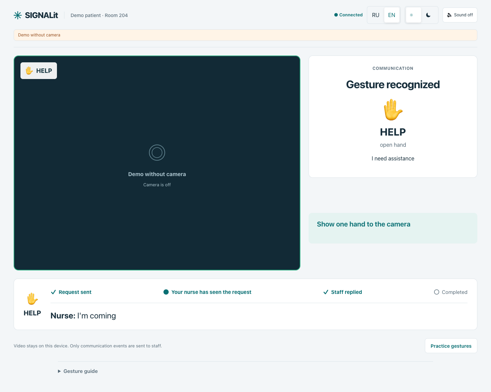
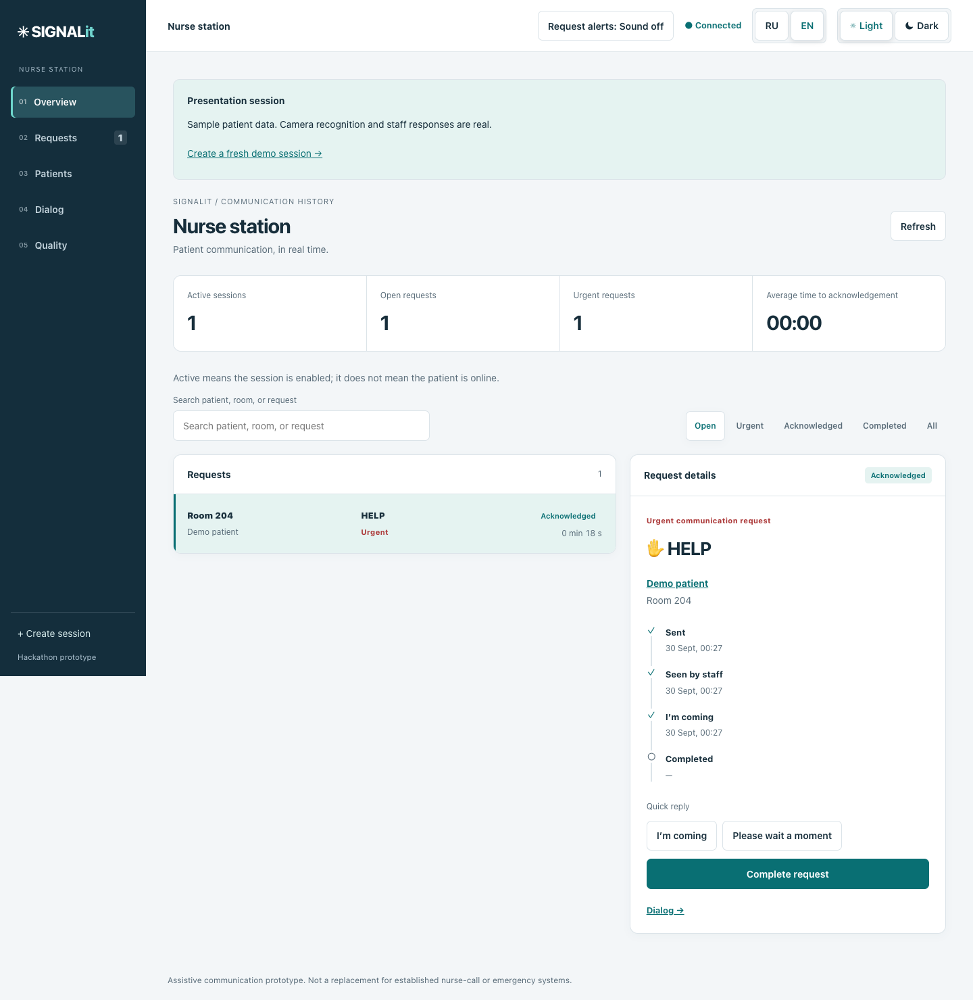
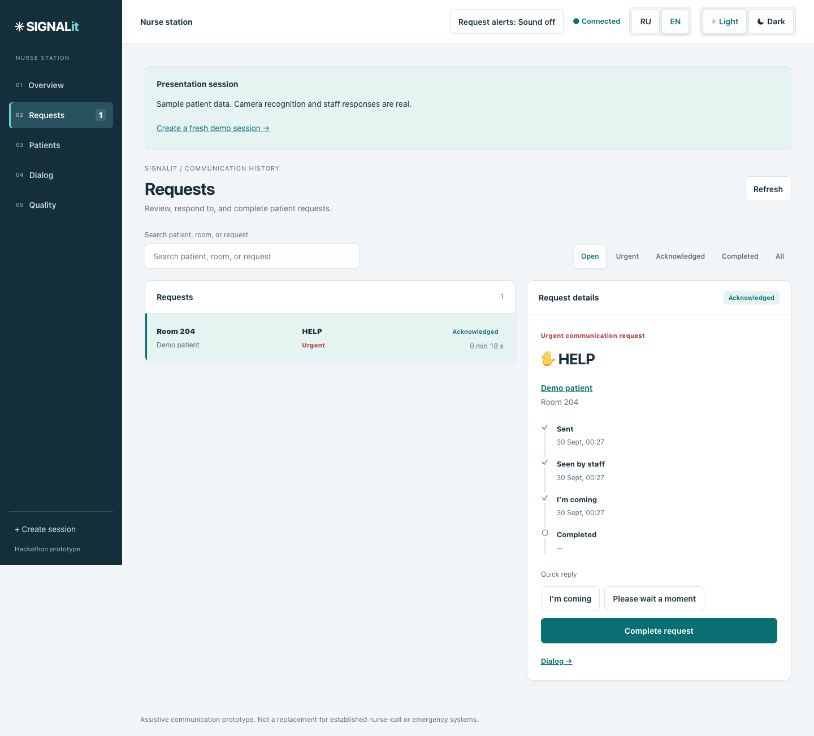
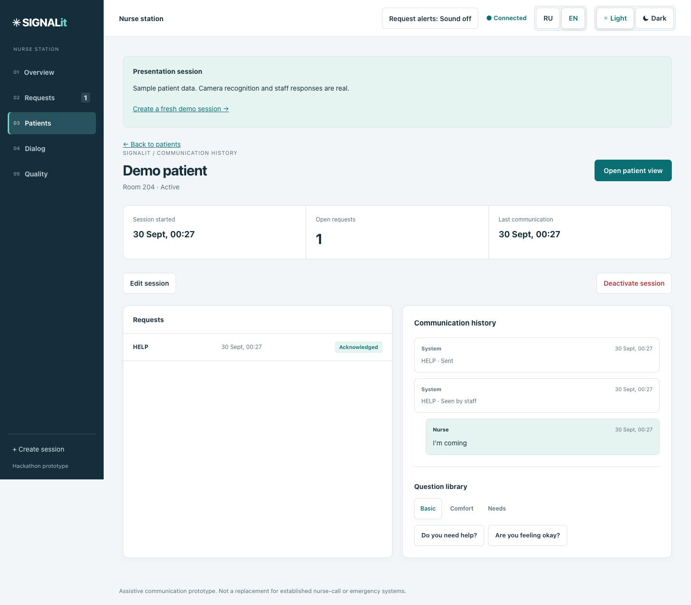
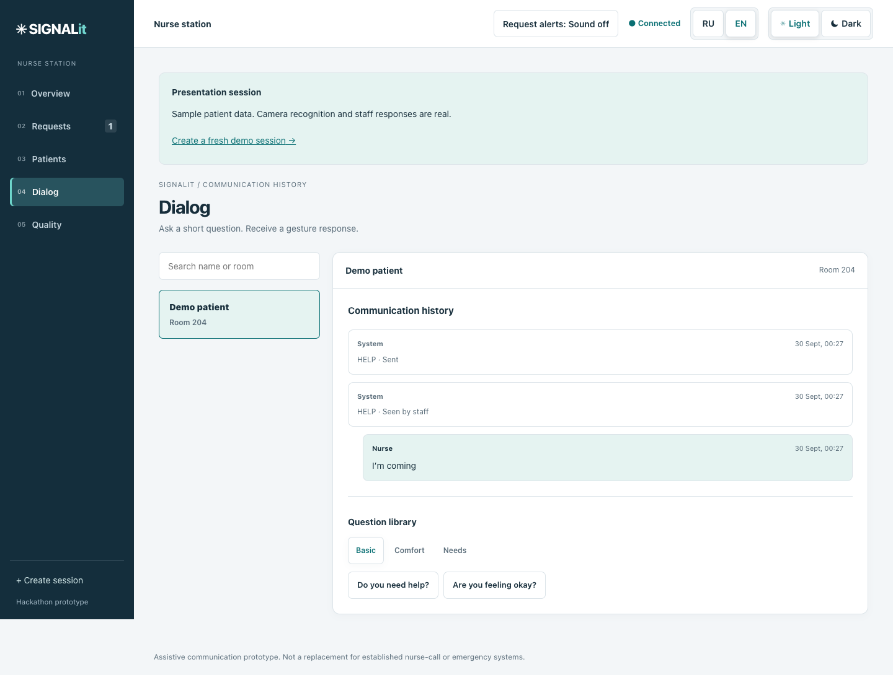
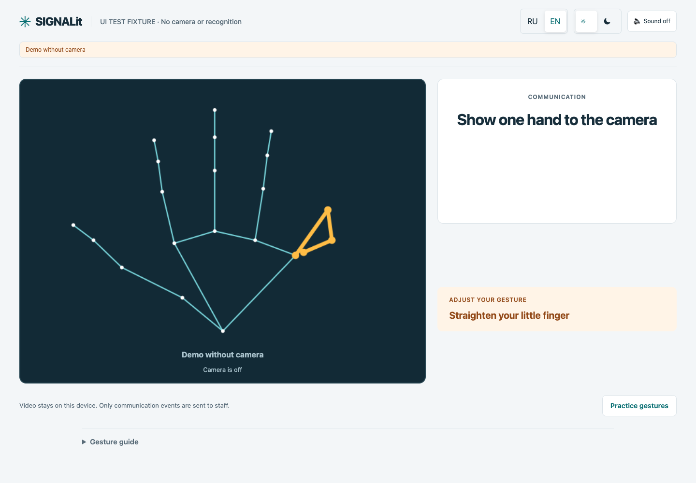
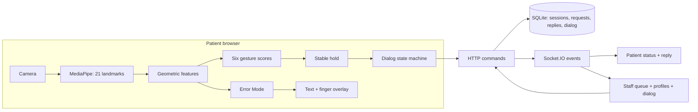
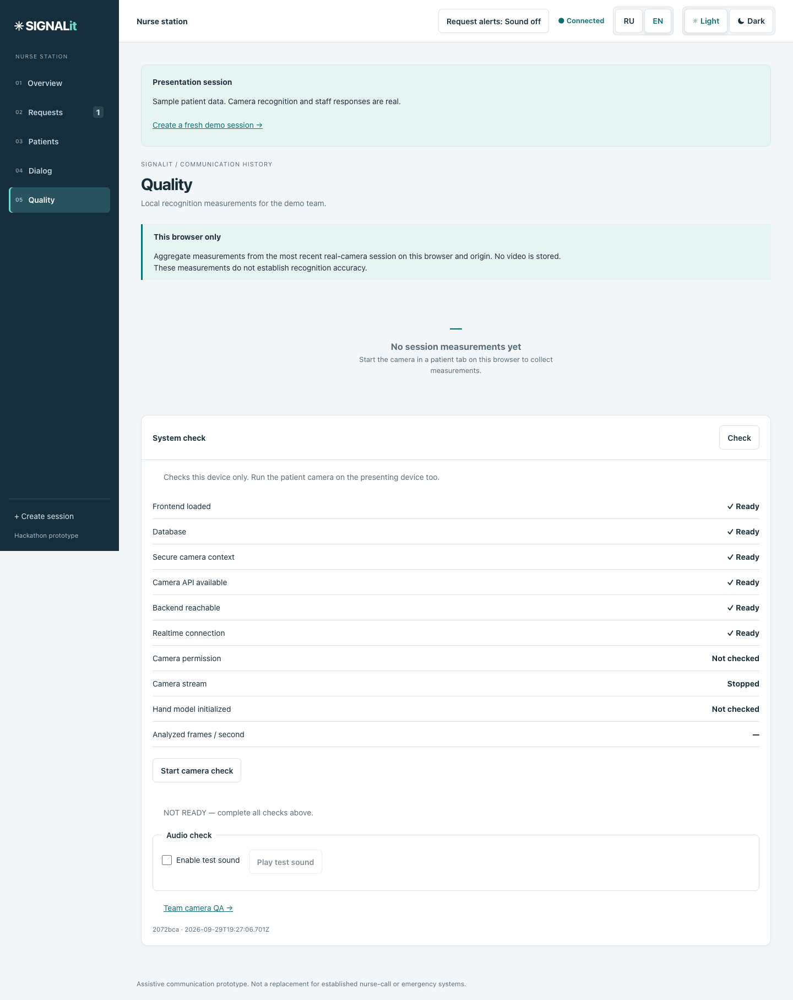

# SIGNALit

Gesture-based bedside communication between patients and staff.



**Gesture → correction → request → staff acknowledgement → reply → completion.**

```bash
npm ci
npm run demo
```

Open `http://localhost:5173/register?demo=1`. Create a sample session, then open its
Patient URL and Staff URL. `npm run preflight` checks the software; the
[physical checklist](docs/REAL_CAMERA_CHECKLIST.md) checks your actual camera.

| Area | Status |
| --- | --- |
| Six gestures, hold and Error Mode | Implemented; core preserved |
| Patient ↔ staff realtime and saved history | Implemented; automated lifecycle/reopen tests |
| RU / EN and team QA exports | Implemented |
| Physical webcam / phone / audible speech | Manual verification required |
| Public deployment | Package prepared; not deployed |
| Medical validation | Not claimed |

## The problem

A patient may understand what is happening but struggle to speak or type. A request also needs a response: has anyone seen it, is someone coming, and has it been completed?

## Our solution

A small gesture vocabulary connects a bedside camera to a nurse station. SIGNALit guides the patient toward a stable pose, sends the confirmed meaning, and shows the staff response. This is a hackathon prototype for assistive communication, not a replacement for established nurse-call or emergency systems.

## Demo flow

Open `/register?demo=1`, create a sample session in room 204, and open the patient link and **this demo queue** on two screens. Every new session starts with an empty scoped queue; earlier records are preserved. Presentation mode uses real camera recognition, HTTP and Socket.IO.

1. Start the patient camera; complete calibration/practice or continue with standard settings.
2. Show HELP with a bent pinky. Follow **“Straighten your little finger”** and its amber finger highlight.
3. Correct the pose and hold. HELP becomes an urgent communication request.
4. Staff acknowledges, sends **“I'm coming”**, and completes it.
5. The patient sees each status and the reply. Refreshing restores server-confirmed requests and reply history.

[Operational checklist, 60-second / 2-minute scripts and backup plan](docs/DEMO.md) · [Judge Q&A](docs/JUDGE_QA.md)

## Patient experience

Camera-first guidance, a stable correction, hold progress, a brief recognition success state, and a prominent staff reply. English/Russian, light/dark theme and optional speech are available. Add `bedside=1` to a patient URL to reduce secondary content.


*Development mock input; camera is off. This screenshot demonstrates the interface and real communication delivery, not camera recognition.*

Camera errors distinguish denied access, missing or busy devices, unsupported access, model startup failure and interrupted video. Delivery errors have an explicit retry; the interface does not label an unconfirmed HTTP send as sent.

## Staff experience

The overview shows open and urgent requests, enabled sessions and measured acknowledgement time. The queue keeps its selected detail after completion, with localized elapsed time, status actions, recent conversation and timestamped replies. Live requests produce a dismissible notification; sound is opt-in. Restoring history does not replay notifications.





*Scoped sample session with real HTTP/Socket.IO and explicitly simulated gesture input.*





“Active session” means enabled, not online presence. Connection status describes the current device's realtime connection.

## Error Mode

The text and finger overlay use the same stable hint and one finger-to-landmark mapping: thumb `1–4`, index `5–8`, middle `9–12`, ring `13–16`, pinky `17–20`. Amber identifies the correction; green briefly marks a corrected finger. Confirmation clears the highlight. Reduced motion is respected.


*Explicit UI fixture with simulated landmark coordinates, not a camera frame or recognition result. It exercises the production drawing helper and localized correction.*

Video is mirrored with CSS; the overlay mirrors X once while drawing. Classification receives the original coordinates. HELP requires all fingers extended; WATER requires the pinky folded. These definitions and the recognition thresholds/hold timing were preserved.

## How gesture recognition works

MediaPipe gives us 21 hand landmarks. SIGNALit converts them into geometric features, scores six gestures, and requires a stable hold before acceptance. Error Mode explains what to adjust. The dialog state machine decides whether a gesture answers a question, requests help, confirms a need, or cancels it.

| Gesture | Pose | Meaning |
| --- | --- | --- |
| YES | Thumb up | Answer / confirm |
| NO | Thumb down | Answer / cancel |
| HELP | Open hand | Assistance |
| PAIN | Closed fist | Pain |
| TOILET | Index extended; middle, ring and pinky folded | Toilet request |
| WATER | Index, middle and ring extended; pinky folded | Water request |

HELP/PAIN send immediately with the existing five-second NO cancellation window. WATER/TOILET require YES. This is a custom six-gesture vocabulary, not sign-language translation. The team did not train MediaPipe.

## Architecture



## Technology

React, TypeScript, Vite, Zustand, MediaPipe, Express, Socket.IO and SQLite. Frame inference and drawing stay outside React. Vitest covers core behavior; Playwright drives two isolated browser contexts through the actual UI. Playwright is a development dependency only.

## Running locally

Use Node 24 and Google Chrome for the browser tests.

```bash
npm ci
npm run demo
```

Ctrl+C stops frontend and backend. Existing two-terminal commands remain available:
`npm run server:dev` and `npm run dev`.

Open `http://localhost:5173`. The normal server now stores data at `./data/signalit.db`; it creates the directory. Set `SIGNAL_DB_PATH` to another file, or `:memory:` for disposable runs. Database files are ignored. Unit/browser/realtime tests explicitly use disposable databases.

`VITE_API_URL` is the frontend's build-time API origin; the default local frontend proxies requests to port 4000 on the laptop. Production defaults to the page's origin and supports a configured HTTPS API origin. Loopback production configuration is rejected or explicitly ignored for an implicit local env file. `FRONTEND_ORIGIN` is the backend's exact origin allowlist. See [deployment configuration and instructions](docs/DEPLOYMENT.md).

**Deployment:** `vercel.json` serves the frontend only. The supported demo setup runs the API/Socket.IO server as a persistent Node process with persistent SQLite storage. Local file persistence is not a claim of durable serverless storage. Cross-device camera access requires HTTPS.

## Routes

| Route | Purpose |
| --- | --- |
| `/` | Patient/staff entry and How it works |
| `/register` | Name, room, session link |
| `/register?demo=1` | Fresh sample session and scoped queue link |
| `/patient` | Session chooser |
| `/patient?patientId=…` | Patient communication |
| `/patient?patientId=…&bedside=1` | Reduced bedside chrome |
| `/dashboard` | Overview and priority queue |
| `/dashboard/requests` | Search, filters, request detail and actions |
| `/dashboard/patients` · `/dashboard/patients/new` | Sessions and creation |
| `/dashboard/patients/:id` | Profile, requests and history |
| `/dashboard/dialog?patientId=…` | Conversation and short questions |
| `/dashboard/quality` | Local measurements and real camera/system check |
| `/dashboard/quality/camera-test` | Team-only real-camera attempts, human review, JSON/CSV |
| `/demo` | Preserved legacy split workspace |
| `/?demo=1` · `/demo?demo=1` | Labeled simulated fallback, isolated in-memory transport |

Development-only `debug=1` enables explicitly labeled mock gesture buttons. It is ignored in production. The UI fixture under `src/ui/patient/dev/` and layout harness are development tools, excluded from the production build.

## Tests

```bash
npm run preflight   # type checks, all fast unit tests, server/frontend builds, source audit
npm run verify      # adds real HTTP/socket smoke and full browser suite
npm run test:judge  # focused judge demo lifecycle
```

Browser tests default to installed Chrome. To use Playwright's Chromium instead: install it with `npx playwright install chromium`, then run `PLAYWRIGHT_CHANNEL=chromium npm run test:e2e`. Tests start isolated servers on ports 5180/5181/4610. There is no lint script.

Coverage includes gesture/hold fixtures, calibration gating, text/highlight stability, mirroring, status ordering, retry keys, append-only history, database migration/reopen, offline retry, reconnect, refresh, camera failure, and the patient–staff UI loop. Screenshot tests cover 390, 430, 768, 1024, 1440 and 1920px. [Current evidence and manual limits](docs/PERSON2_FINAL_REPORT.md).

## Quality measurement

Only the real camera adapter records aggregate analyzed FPS, visible-hand frames, confirmations, interrupted holds, correction hints and confirmation time. No video or landmarks are saved by this measurement flow. Export the latest local session as JSON. These are **not accuracy measurements**; structured ground-truth team trials remain separate work.

Calibration advances only on valid stable samples, with at least 20 per pose. Missing/poor input pauses progress. The calibrated hand-size baseline adjusts diagnostic guidance, not classifier thresholds.



The system check opens the camera only after a click, initializes MediaPipe and waits for analyzed frames. READY requires frontend, secure context, backend, database query, realtime, camera permission/stream/model and positive current FPS. It includes an explicit neutral sound test and a subtle build identifier. A check on the laptop does not validate a phone camera.

Team camera QA guides YES, NO, HELP, PAIN, TOILET and WATER. Fast mode covers one hand in normal conditions; Extended covers both hands and allows extra lighting/distance trials. It measures candidate/confirmation timing, corrections, targeted finger, FPS and tracking, then asks for human recognition, alignment and false-trigger review. Results stay in memory until JSON/CSV download. [Use the blank results template](docs/CAMERA_QA_RESULTS.md); no real results are invented.

## Privacy and limitations

Video processing stays on the patient device. The backend stores sample display name/room, semantic requests, status times, append-only replies, questions and answers. Earlier databases migrate additively; legacy replies without timestamps remain labeled as such.

There is no authentication, authorization, clinical validation, durable offline outbox, or multi-server coordination. Use sample data in a controlled demo setting. A failed send can be retried while the page remains open; refreshing loses unsent commands. Saved server requests survive refresh and local server restart. Patient UI foregrounds the most recent request; staff retains the full queue.

The existing 11 fixtures from one participant are regression evidence, not population accuracy. Actual hand performance, phone mirroring, speech/audio and assistive-technology behavior still need device checks. QR generation encodes only the exact session URL. On a phone use a reachable trusted HTTPS address; scanning a laptop localhost URL does not make it reachable.

## Hackathon demo checklist

Use the [30-minute and 2-minute checklists](docs/DEMO.md), [judge answers](docs/JUDGE_QA.md), and [screenshot gallery](docs/assets/README.md). Present the real camera workflow first; identify all test-input screenshots or mock demonstrations explicitly.

## Third-party attribution

The project uses MediaPipe and the open-source technologies listed above, plus a small
MIT-licensed QR generator. [Third-party metadata and asset provenance](docs/THIRD_PARTY.md)
records the installed package licenses. No project-level license is supplied in this archive;
that choice belongs to the project owners. No affiliation with reference products is claimed.

## Final Experience handoff

See the [software closure report](docs/PERSON2_FINAL_REPORT.md), [Git delivery status](docs/GIT_HANDOFF.md),
[silent usability protocol](docs/USABILITY_TEST.md), [backup video script](docs/BACKUP_VIDEO_SCRIPT.md),
and [two-minute pitch](docs/PITCH_2MIN.md). Physical trials and human results remain unclaimed.
